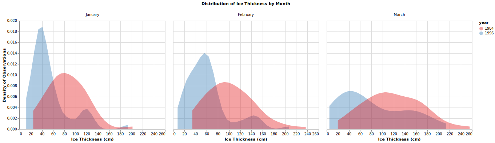

```{r setup, include=FALSE}
knitr::opts_chunk$set(echo = FALSE, fig.align = "center")
library(knitr)
library(kableExtra)
library(tidyverse)
```

# Summary

We are trying to answer the question, did the median ice thickness in the Canadian Arctic change by a statistically significant amount from the years 1984 to 1996? This question stems from the rising global temperatures and a curiosity of how this warming impacts the depth of the ice. The dataset used in this analysis contains measurements of ice thickness at various established monitoring stations in the Canadian Arctic on a weekly basis. Using exploratory data analysis (EDA) we determined that the data is right skewed. This informed our decision to compare the median ice thicknesses for 1984 and 1996 using a hypothesis test for independence for difference in medians using permutation for our analysis.

# Methods

## Data

The dataset used in this analysis contains measurements of ice thickness at various established monitoring stations in the Canadian Arctic on a weekly basis. The data is made available from the Government of Canada and the monitoring is done by the Canadian Ice Thickness Program. Information about the program can be accessed through the Government of Canada and the specific dataset we are using is publicly available [here](https://www.canada.ca/content/dam/eccc/migration/main/data/ice/products/ice-thickness-program-collection/ice-thickness-program-collection-1947-2002/original_program_data_20030304.xls).

## Analysis

First let's have a look at the median ice thickness for the entire dataset, which spans from 1981 to 2002.

```{r, median over time, fig.cap="Figure 1. Median Ice Thickness Over Time", out.width = '75%'}
knitr::include_graphics("../results/median_thickness_year.svg")
```

The figure above shows the median ice thicknesses of the monthly station averages from 1981 to 2002. Excluding the year 2002, where there were significantly fewer observations, there looks to be a downward trend from the earlier years where the median thickness is around 90 centimeters to the later years where it hovers around 60-70 centimeters. Our analysis aims to validate this trend and determine if the downward trend is statistically significant. We decided to compare median ice thickness between the years 1984 and 1996 because the years are as far apart as possible while still maintaining a large sample size.  

Let's take a look at the density distribution for three months with the largest number of measurements to determine whether the difference in median thickness of ice is subject to a certain month of interest or whether this difference is present throughout all months. An exploration of additional months can be found in our [EDA report](https://htmlpreview.github.io/?https://raw.githubusercontent.com/UBC-MDS/global_warming_effects_on_ice_thickness/main/src/ice_thickness_eda.html). 

```{r, density, fig.cap="Figure 2. Distribution of Ice Thickness by Month", out.width = '100%'}

```

We can see that 1984 distribution has more mass to the right of the 1996, meaning that a higher proportion of observations that recorded thicker ice measurements. The pattern is present for all three months, however, January shows the sharpest example of this whereas the effect is less prominent in March.

In this analysis, we will compare the median ice thickness measurements between January of 1984 and January of 1996 and conduct a hypothesis test to determine if the difference in medians is statistically significant. We decided to use a hypothesis test for independence of a difference in medians using permutation. The permutation test assumes that all observations are independent, so we have adjusted our data in order to meet this condition. The ice thickness measurements are taken weekly, so we decided to take the mean of the ice thickness per station per month in order to compare with other years. With this methodology we satisfy the condition that the observations are from different individuals (stations).

Our null hypothesis is that the median ice thickness in 1984 is the same as the median ice thickness in 1994. Our alternative hypothesis is that the median ice thickness in 1984 is different than median ice thickness in 1994.

$H_0 = \text{median}_{1984} - \text{median}_{1994} = 0$

$H_A = \text{median}_{1984} - \text{median}_{1994} \neq 0$

For our hypothesis test we chose an $\alpha = 0.05$, however we would need to do further research to determine if this is the domain standard.

The analysis was completed using the R and Python programming languages [@R]; [@Python]. The R packages used to to perform the analysis are `tidyverse` [@tidyverse], `dplyr` [@dplyr], `datateacher` [@datateacher], `infer` [@infer], `ggplot2` [@ggplot], `purrr` [@purrr], `knitr` [@knitr], `docopt` [@r-docopt], `svglite` [@svglite], and `rmarkdown` [@rmarkdown]. The Python packages used for the EDA and data wrangling scripts are `pandas` [@pandas], `docopt` [@python-docopt], `altair` [@altair], `altair_saver` [@altair_saver], `pandas-profiling` [@pandasprofiling], `pytest` [@pytest], `xlrd` [@xlrd], `ipykernel` [@ipykernel] and `chromedriver_binary` [@chromedriver_binary]. The permutation test analysis is based on [UBC MDS 552 Lab 2](https://github.ubc.ca/MDS-2020-21/DSCI_552_stat-inf-1_students/blob/master/solutions/lab2/lab2.Rmd). The code used to perform the analysis and create this report can be found here: [here](https://github.com/UBC-MDS/global_warming_effects_on_ice_thickness).

# Results

We calculated that the difference between the sample medians of average ice thickness measurements by station for January of 1984 and January of 1996 and the corresponding 95% confidence intervals. Although our analysis only focused on January 1984 vs January of 1996, we can see from the plot below that there may be other combinations of years which may yield more significant results. 

```{r, 95ci, fig.cap="Figure 3. 95% Confidence Intervals for Median Ice Thickness in per Year in January", out.width = '80%'}
knitr::include_graphics("../results/median_ice_thickness_ci.svg")

```

```{r, message=FALSE, warning=FALSE}

pval <- read_csv("../results/p_value.csv")

```

Using the permutation test we determined the p-value for January is $`r pval$p_value[[1]]`$. Our p-value from our test of independence of a difference in medians using permutation was less than $\alpha = 0.05$, so we reject our null hypothesis, $H_0$. Based on this evidence, it appears that there is a statistically significant difference between the median ice thickness measurements of January 1984 and January 1996.

# Conclusion

Using a permutation test we were able to determine that the there is likely a statistically significant difference between median ice thickness measurements in January 1984 and January 1996. Although this conclusion intuitively supports the existence of global warming, we cannot determine if is actually part of a trend without a far more sophisticated analysis. 

A time-series experiment that looks at the relationships between additional months and years would be of interest for future experiments. Unfortunately it is beyond the scope of this project, as we have not covered the required methods to do such an analysis yet in MDS. As can be seen in the Figure 3, the years we have chosen have overlapping confidence intervals and the medians are not as dissimilar as other combinations of months and years. Furthermore, the seasonality of the data (ice melting and freezing) every year lends itself well to more sophisticated time series analysis where this seasonality can be taken into account. This would create a more rigorous analysis and allow us to further explore the changes in ice thickness over time.

# References
