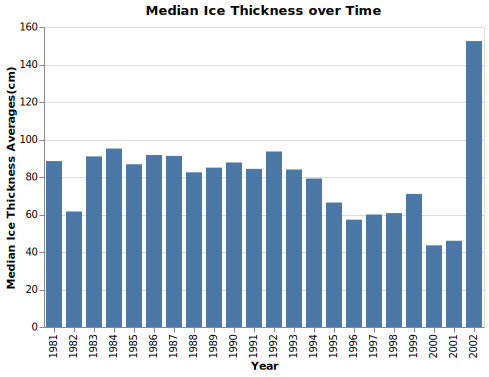
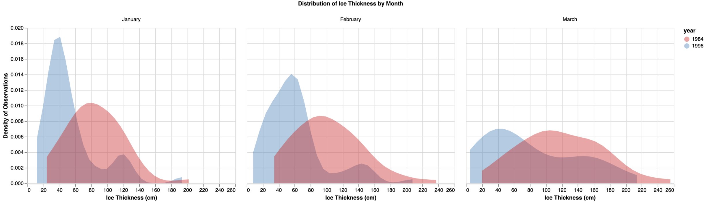
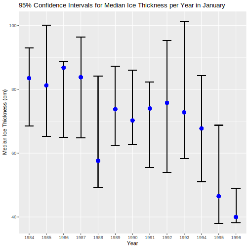

Global Warming Effects on Ice Thickness
================

# Summary

We are trying to answer the question, did the median ice thickness in
the Canadian Arctic change by a statistically significant amount from
the years 1984 to 1996? This question stems from the rising global
temperatures and a curiosity of how this warming impacts the depth of
the ice. The dataset used in this analysis contains measurements of ice
thickness at various established monitoring stations in the Canadian
Arctic on a weekly basis. Using exploratory data analysis (EDA) we
determined that the data is right skewed. This informed our decision to
compare the median ice thicknesses for 1984 and 1996 using a hypothesis
test for independence for difference in medians using permutation for
our analysis.

# Methods

## Data

The dataset used in this analysis contains measurements of ice thickness
at various established monitoring stations in the Canadian Arctic on a
weekly basis. The data is made available from the Government of Canada
and the monitoring is done by the Canadian Ice Thickness Program.
Information about the program can be accessed through the Government of
Canada and the specific dataset we are using is publicly available
[here](https://www.canada.ca/content/dam/eccc/migration/main/data/ice/products/ice-thickness-program-collection/ice-thickness-program-collection-1947-2002/original_program_data_20030304.xls).

## Analysis

First let’s have a look at the median ice thickness from 1981 to 2002.

Figure 1. Median Ice Thickness Over Time

The above figure shows the median ice thicknesses of the monthly station
averages from 1981 to 2002. Excluding the year 2002, there looks to be a
downward trend from the earlier years where the median thickness is
around 90 centimeters to the later years where it hovers around 60-70
centimeters. Our analysis aims to validate this trend and determine if
the downward trend is statistically significant.

Let’s take a look at the density distribution to determine whether the
difference in median thickness of ice is subject to a certain month or
whether this difference is present throughout all months.

Figure 2. Distribution of Ice Thickness by Month

We can see that 1984 distribution has more mass to the right of the
1996, meaning that a higher proportion of observations that recorded
thicker ice measurements. The pattern is present for all three months,
however, January shows the sharpest example of this whereas the effect
is less prominent in March.

In this analysis, we will compare the median ice thickness measurements
between January of 1984 and January of 1994 and conduct a hypothesis
test to determine if the difference in medians is statistically
significant. We decided to use a hypothesis test for independence of a
difference in medians using permutation. The permutation test assumes
that all observations are independent, so we have adjusted our data in
order to meet this condition. The ice thickness measurements are taken
weekly, so we decided to take the mean of the ice thickness per station
per month in order to compare with other years. With this methodology we
satisfy the condition that the observations are from different
individuals (stations).

Our null hypothesis is that the median ice thickness in 1984 is the same
as the median ice thickness in 1994. Our alternative hypothesis is that
the median ice thickness in 1984 is different than median ice thickness
in 1994.

*H*0 = median1984 − median1994 = 0

*H**A* = median1984 − median1994 ≠ 0

For our hypothesis test we chose an *α* = 0.05, however we would need to
do further research to determine if this is the domain standard.

The analysis was completed using the R and Python programming languages
(R Core Team 2019); (Van Rossum and Drake 2009). The R packages used to
to perform the analysis are tidyverse (Wickham 2017), dplyr (Wickham et
al. 2015), datateacher (Boyce and Bourak 2020), infer (Grömping 2010),
ggplot (Wickham 2016a), purrr (Wickham 2016b), knitr (Xie 2014), docopt
(de Jonge 2018), and svglite (**wickham2020svglit?**). The Python
packages used for the EDA and data wrangling scripts are pandas (team
2020), docopt (Keleshev 2014) altair (Developers, n.d.), altair\_saver
(Vanderplas 2019), pandas-profiling (Brugman 2019), pytest (Krekel et
al. 2004), and chromedriver\_binary (Kaiser 2017). The permutation test
analysis is based on [UBC MDS 552 Lab
2](https://github.ubc.ca/MDS-2020-21/DSCI_552_stat-inf-1_students/blob/master/solutions/lab2/lab2.Rmd).
The code used to perform the analysis and create this report can be
found here:
[here](https://github.com/UBC-MDS/global_warming_effects_on_ice_thickness).

# Results

We calculated that the difference between the sample medians of average
ice thickness measurements by station for January of 1984 and January of
1994 and the corresponding 95% confidence intervals. Although our
analysis only focused on January 1984 vs January of 1994, we can see
from the plot below that there may be other combinations of years which
may yield more significant results.

Figure 3. 95% Confidence Intervals for Median Ice Thickness in per Year
in January

Using the permutation test we determined the p-value for January is
**0.034**. Our p-value from our test of independence of a difference in
medians using permutation was less than *α* = 0.05, so we reject our
null hypothesis, *H*0. Based on this evidence, it appears
that there is a statistically significant difference between the median
ice thickness measurements of January 1984 and January 1994.

A time-series experiment that looks at the relationships between
additional months and years would be of interest for future experiments.
Unfortunately it is beyond the scope of this project, as we do not
covered the required methods to do such an analysis yet in MDS. As can
be seen in the Figure 3, the years we have chosen have overlapping
confidence intervals and the medians are not as dissimilar as other
combinations of months and years. Furthermore, the seasonality of the
data (ice melting and freezing) every year lends itself well to more
sophisticated time series analysis where this seasonality can be taken
into account. This would create a more rigorous analysis and allow us to
further explore the changes in ice thickness over time.

# References

Boyce, Hayley, and Jordan Bourak. 2020. *Datateachr: Data Collected to
Use for Teaching at the University of British Columbia*.
<https://github.com/UBC-MDS/datateachr>.

Brugman, Simon. 2019. “pandas-profiling:
Exploratory Data Analysis for Python.”
<https://github.com/pandas-profiling/pandas-profiling>.

de Jonge, Edwin. 2018. *Docopt: Command-Line Interface Specification
Language*. <https://CRAN.R-project.org/package=docopt>.

Developers, Altair. n.d. *Altair 4.1.0*. *Python Package Index.
Available:https://Altair-Viz.github.io/Index.html*.

Grömping, Ulrike. 2010. “Inference with Linear Equality and Inequality
Constraints Using R: The Package ic.infer.”
*Journal of Statistical Software* 33 (10): 1–31.
<http://www.jstatsoft.org/v33/i10/>.

Kaiser, Daniel. 2017. “Python Chromedriver Binary.”
<https://github.com/danielkaiser/python-chromedriver-binary/blob/master/LICENSE>.

Keleshev, Vladimir. 2014. *Docopt: Command-Line Interface Description
Language*. <https://github.com/docopt/docopt>.

Krekel, Holger, Bruno Oliveira, Ronny Pfannschmidt, Floris Bruynooghe,
Brianna Laugher, and Florian Bruhin. 2004. “Pytest x.y.”
<https://github.com/pytest-dev/pytest>.

R Core Team. 2019. *R: A Language and Environment for Statistical
Computing*. Vienna, Austria: R Foundation for Statistical Computing.
<https://www.R-project.org/>.

team, The pandas development. 2020. *Pandas-Dev/Pandas: Pandas* (version
latest). Zenodo. <https://doi.org/10.5281/zenodo.3509134>.

Van Rossum, Guido, and Fred L. Drake. 2009. *Python 3 Reference Manual*.
Scotts Valley, CA: CreateSpace.

Vanderplas, Jake. 2019. “Altair Saver.”
<https://github.com/altair-viz/altair_saver>.

Wickham, Hadley. 2016a. *Ggplot2: Elegant Graphics for Data Analysis*.
Springer-Verlag New York. <https://ggplot2.tidyverse.org>.

———. 2016b. *Purrr: Functional Programming Tools*.
<https://CRAN.R-project.org/package=purrr>.

———. 2017. *Tidyverse: Easily Install and Load the ’Tidyverse’*.
<https://CRAN.R-project.org/package=tidyverse>.

Wickham, Hadley, Romain Francois, Lionel Henry, Kirill Müller, and
others. 2015. “Dplyr: A Grammar of Data Manipulation.” *R Package
Version 0.4* 3.

Xie, Yihui. 2014. “Knitr: A Comprehensive Tool for Reproducible Research
in R.” In *Implementing Reproducible Computational Research*, edited by
Victoria Stodden, Friedrich Leisch, and Roger D. Peng. Chapman;
Hall/CRC. <http://www.crcpress.com/product/isbn/9781466561595>.

