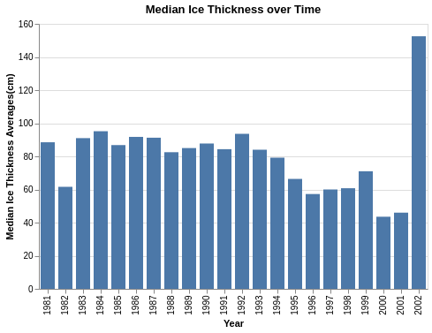

```python
import pandas as pd
import altair as alt
```


```python
df = pd.read_csv('../data/processed/ice_thickness.csv')

```

# Summary of the data set

The [data set](https://www.canada.ca/en/environment-climate-change/services/ice-forecasts-observations/latest-conditions/archive-overview/thickness-data.html) is from the Canadian Ice Thickness Program. The data has been collected weekly since 1947. The program was updated in 2002, so we are only looking at data prior to the update. Ice thickness is measured to the nearest centimetre using one of two methods; special auger kit or hot wire ice thickness gauge. 

# Exploratory analysis of Ice Thickness

To better understand our data and to determine how to sample it we explored: 
- Number of ice thickness measurements per date
- Number of stations per date
- General change in ice thickness over time
- Distribution of ice thickness over all time
- Distribution of ice thickness for each date of interest
- Determine if there are outliers in the ice thickness measurements

We removed records with `Measurement Method` not equal to 1 in order to make sure the measurement method we are looking at is consistent. 
We also removed all records missing an `Ice Thickness` measurement.

We then grouped the observations by station and month and took we mean of these values so we now have observations at a monthly frequency for every station in the data. This allows us to move forward with our analysis to compare the medians of these monthly station averages.

### Median thickness over time by year

The below figure shows the median ice thicknesses of the monthly station averages for 1981 to 2002. Excluding the year 2002, there looks to be a downward trend from the earlier years where the median thickness is around 90 centimeters to the later years where it hovers around 60-70 centimeters. Our analysis aims to validate this trend and determine if the downward trend is statistically significant.


```python
mean_thickness_year = (alt.Chart(df).mark_bar(size=16).encode(
        y = alt.Y("median(mean_ice_thickness)", title="Median Ice Thickness Averages(cm)"),
        x = alt.X("year:O", title="Year"))
    .properties(background='white', 
                title='Median Ice Thickness over Time'))
```



### Distribution of the monthly data

#### Boxplot of mean ice thickness
We looked at boxplots of the observations by month There are not many observations that seem out of place. The distributions vary by month quite significantly, with the highest mean thickness in June. 


```python
month_boxplot = alt.Chart(df, title="Mean Ice Thickness by Month").mark_boxplot().encode(
    y=alt.Y("mean_ice_thickness", title="Ice Thickness (cm)"),
    x=alt.X("month", title="Month"),
    tooltip=["mean_ice_thickness", "month", "station_name"]
)
```


#### Bar chart to show monthly distribution

The figure below looks at the distribution of thickness measurements over each month. The distribution over all time and the distributions per year are right skewed. The shape of the distributions by month vary from month to month. We also see that that the months with the highest mean ice thickness are also those with the fewest observations and likely would not be great months to include in our analysis as they lack observations for a large sample. Months 1 (January), 2 February) and 3 (March) have a sufficient amount of observations for our study.


```python
# Distribution of ice thickness over all time

ice_histogram = alt.Chart(df, title="Ice thickness measurements over all time").mark_bar().encode(
    x = alt.X("mean_ice_thickness", title="Ice Thickness (cm)", bin=alt.Bin(maxbins=40)),
    y = alt.Y("count()", title="Number of measurements"), 
    
).properties(
    width=150,
    height=150
).facet(
    "month",
    columns=4)
```


#### Exploring distributions in key months

Looking at the below figures, we have the distribution of ice thickness observations (monthly station averages) for the 1984 (red) and 1996 (blue). The three charts shows these distributions for each of January, February and March separately. We do this because we are curious as to whether the difference in median thickness of ice is subject to a certain month or whether this difference is present through all months. We can see that 1984 distribution has more mass to the right of the 1996, meaning more observations that record thicker ice. The pattern is present for all three months, however, January shows the sharpest example of this whereas the effect is less prominent in March. 


```python
df_density = df.query('(year in [1984,1996]) & (month in [1,2,3])')
month_names = {1: "January", 2:"February", 3:"March"}
df_density = df_density.replace({"month":month_names})
    
    # create figure
density = (alt.Chart(df_density)
        .transform_density(
            'mean_ice_thickness',
            groupby = ['year', 'month'],
            as_=['mean_ice_thickness','density']
        )
        .mark_area(opacity=0.4).encode(
           x=alt.X('mean_ice_thickness:Q', title="Ice Thickness (cm)"),
           y=alt.Y('density:Q', title="Density of Observations"),
           color=alt.Color('year:O', scale=alt.Scale(scheme="set1")))
        .properties(height=200, width=175)
        .facet(column=alt.Row("month",
                              title='Distribution of Ice Thickness by Month',
                              sort=['January','February','March']), 
               background='white'))
```


